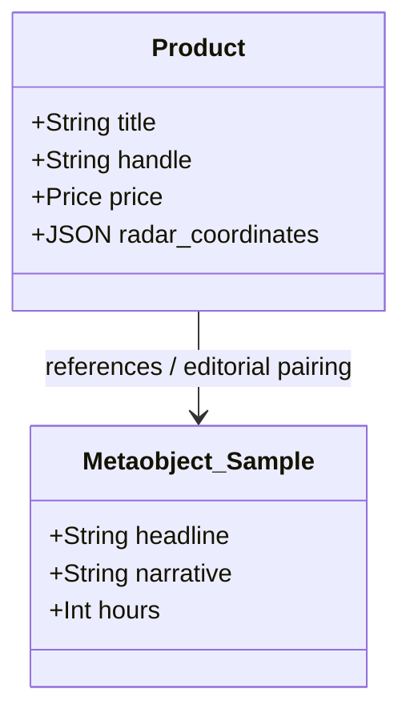

# Architectural Specification & Handoff Dossier: [Feature Title]

## 1. Executive Summary & Business Objective
- **Business Need**: [Concise summary of merchant / client requirement]
- **Target Experience**: [How this appears in the headless storefront]
- **Architectural Strategy**: [Overview of selected entities and data flow]

---

## 2. Entity Relationship Diagram (ERD)



---

## 3. Detailed Entity Dictionary

### 3.1 Metaobject: `[type_name]`
| Field Key | Type | Storefront Access | Description & Sample Value |
| :--- | :--- | :--- | :--- |
| `title` | `single_line_text_field` | PUBLIC_READ | Editorial title |

### 3.2 Product Metafields
| Key | Namespace | Type | Description |
| :--- | :--- | :--- | :--- |
| `radar_coordinates` | `custom` | `json` | Anatomical hotspot coordinates |

---

## 4. Storefront GraphQL Query Design
```graphql
query GetFeatureData {
  metaobjects(type: "[type_name]", first: 10) {
    edges {
      node {
        handle
        fields {
          key
          value
        }
      }
    }
  }
}
```

---

## 5. Machine Blueprint Handoff Reference
- Blueprint File: `docs/architecture/blueprints/[feature_name]_blueprint.json`
- Seeding Command: `npm run shopify:seed -- --blueprint docs/architecture/blueprints/[feature_name]_blueprint.json`

---

## 6. Review & Approval Gate
- [ ] Main Agent has reviewed schema compatibility with Storefront GraphQL API.
- [ ] User has approved field naming and structure.
- [ ] Provisioning script is ready to execute.
