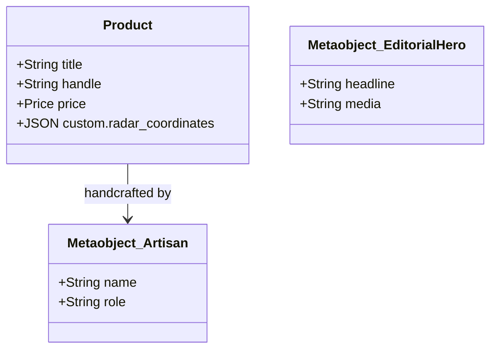

# Consolidated Master Schema Hierarchy & Visual Architecture Dossier

## 1. Executive Summary & Visual Sitemap
- **Input Corpus**: [List all images and notes evaluated]
- **Synthesized Architecture Overview**: [Summary of the unified entity model]

---

## 2. Global Entity Relationship Diagram (ERD)



---

## 3. Unified Shopify Metaobject Definitions Directory

| Metaobject Type | Name | Purpose | Fields & Types | Storefront Access |
| :--- | :--- | :--- | :--- | :--- |
| `hero_editorial` | Hero Editorial | Full-bleed runway hero | `eyebrow` (string), `headline` (string), `media_banner` (url) | PUBLIC_READ |
| `craft_story` | Craft Story | Atelier savoir-faire | `headline` (string), `savoir_faire_hours` (integer) | PUBLIC_READ |

---

## 4. Product & Collection Metafield Directory

| Resource | Namespace | Key | Type | Description |
| :--- | :--- | :--- | :--- | :--- |
| Product | `custom` | `radar_coordinates` | `json` | Hotspot coordinates & anatomical markers |
| Product | `custom` | `fabric_spec` | `single_line_text_field` | Material provenance |

---

## 5. Polymorphic Section Mapping for Headless Frontend

Mapping from Metaobject types to dynamic headless components:

```
Shopify Metaobject Type   -->   Headless Component (DynamicSectionRenderer)
--------------------------------------------------------------------------
hero_editorial            -->   <HeroEditorialSection />
craft_story               -->   <CraftStorySection />
artisan_profile           -->   <ArtisanProfileSection />
```

---

## 6. Recommendations & Next Steps for Main Agent
- [ ] Review schema field naming conventions.
- [ ] Feed this master hierarchy into `shopify-entity-architect` to generate the machine-readable JSON blueprint.
- [ ] Run `node scripts/shopify-provision.mjs --blueprint <path>` to provision schemas in Shopify Admin.
