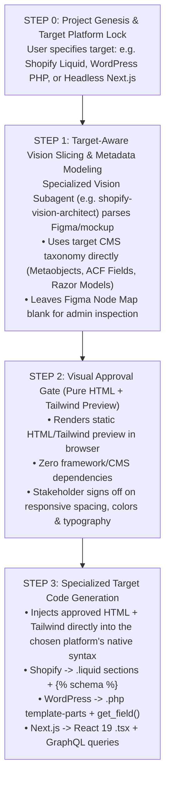

# 🗺️ Universal CMS & Agency Framework: Future Architectural Improvements & Roadmap

This document outlines high-impact architectural enhancements and roadmap milestones designed to increase throughput, automate cross-platform bindings, and eliminate manual friction across multi-client engagements.

---

## 1. Schema-Driven Figma Node Map & Fallback Annotation (Figma JSON First)

> [!TIP]
> **Approach:** Ground Truth in Figma JSON AST with Human-in-the-Loop Node Map Overrides  
> **Status:** Recommended Architecture Pattern  
> **Target Schema:** `inputs/vision/[slug].json` & Visual Annotator Studio

### 1.1 Core Principle: Figma JSON is the Primary Ground Truth
- The offline Figma JSON dump (`Docs/DirectDataDump/`) is the **first-priority source of truth** for colors, typography, vectors, layout hierarchy, and spacing tokens.
- Complex geometric coordinate mapping (IoU / spatial bounding box projection) introduces unnecessary algorithmic overhead and edge-case fragility.
- Instead, the workflow should use **direct Node Mapping annotations**: when an area has complex nesting, multiple overlapping layers, or ambiguity, the user or visual annotator provides an explicit **`figmaNodeId`** or **`nodePath`** directly in the block metadata.

### 1.2 Schema Extension in `inputs/vision/[slug].json`
Extend block objects to include optional Figma grounding fields:

```json
{
  "id": "block_2",
  "title": "Hero Editorial Banner",
  "category": "Hero Editorial",
  "entityType": "metaobject",
  "targetSchema": "homepage_hero_editorial",
  "figmaNodeMap": {
    "nodeId": "28:604",
    "layerName": "Hero / Desktop / Editorial Banner",
    "primaryComponent": "Organism/HeroBanner",
    "inspectNotes": "Extract typography from node 28:612 and background fill from 28:605"
  },
  "keyFields": ["eyebrow", "headline", "cta_text", "cta_url", "background_image"],
  "notes": "Full-bleed hero banner featuring shadow play photography.",
  "coordinates": { "x": 0.0, "y": 1.25, "width": 100.0, "height": 11.2 }
}
```

### 1.3 How the AI Agent Uses the Node Map
1. **Direct AST Lookup**: When generating the component for `block_2`, the subagent queries the exact node:
   ```bash
   node scripts/figma-dump.mjs --node "28:604"
   ```
2. **Ambiguity Resolution**: If a visual slice has ambiguous sub-elements (e.g. nested modal, multi-level dropdown), the agent reads `inspectNotes` and the exact sub-node IDs instead of guessing.
3. **Graceful Fallback**:
   - **If `figmaNodeMap.nodeId` is provided**: Extract exact AST properties from the Figma JSON dump.
   - **If `figmaNodeMap.nodeId` is omitted**: Use the visual screenshot + companion JSON keyFields to generate the layout heuristically.

---

## 2. Design Token Auto-Fixer & Codemod (`npm run lint:tokens --fix`)

> [!TIP]
> **Complexity Level:** Medium  
> **Status:** Recommended Next Implementation  
> **Target Module:** `scripts/audit-tokens.mjs`

### 2.1 The Problem
AI-generated code and rapid prototypes frequently contain arbitrary bracket notation (`bg-[#5042D7]`, `w-[260px]`, `rounded-[14px]`). While [`scripts/audit-tokens.mjs`](file:///c:/Sudipto/UniversalCMSWorkflow/scripts/audit-tokens.mjs) flags these errors, fixing them currently requires manual regex edits or hand-modifying dozens of files.

### 2.2 Proposed Solution
Implement an automated `--fix` flag for the token auditor:
1. **Token Extraction**: Detect all unique arbitrary hex values and measurements across `src/components/` and `src/app/`.
2. **Variable Generation**: Auto-generate semantic CSS custom properties in [`src/styles/tokens.css`](file:///c:/Sudipto/UniversalCMSWorkflow/src/styles/tokens.css) if they don't already exist.
3. **AST Codemod Replacement**: Replace arbitrary classes with their corresponding Tailwind semantic token aliases:
   - `bg-[#5042D7]` $\rightarrow$ `bg-primary`
   - `border-[#EFEFEF]` $\rightarrow$ `border-border-subtle`
   - `w-[260px]` $\rightarrow$ `w-sidebar`
4. **CI Guarantee**: Ensures `npm run lint:tokens` passes cleanly on every build.

---

## 3. Universal Multi-CMS Prop Adapter Layer

> [!IMPORTANT]
> **Complexity Level:** Low - Medium  
> **Status:** Architecture Blueprint Defined  
> **Target Directory:** `src/adapters/`

### 3.1 The Problem
Headless CMS platforms format identical component data in divergent payload structures:
- **Shopify**: `metaobject.fields.find(f => f.key === 'headline').value`
- **Contentful**: `entry.fields.headline['en-US']`
- **Sitecore**: `rendering.fields.Headline.value`
- **WordPress ACF**: `acf.headline`

Directly referencing CMS-specific field formats inside React components makes them rigid and vendor-locked.

### 3.2 Proposed Architecture
Introduce a universal transformation adapter layer:

```text
src/
├── adapters/
│   ├── index.ts              # Universal adapter dispatcher
│   ├── shopify.adapter.ts    # Transforms Shopify GraphQL -> ComponentProps
│   ├── contentful.adapter.ts # Transforms Contentful REST/GraphQL -> ComponentProps
│   ├── sitecore.adapter.ts   # Transforms Sitecore Layout Service JSON -> ComponentProps
│   └── wordpress.adapter.ts  # Transforms WPGraphQL -> ComponentProps
└── components/modules/       # 100% Pure React 19 UI Primitives (CMS-Agnostic)
```

### 3.3 Example Contract
```typescript
// Shared Component Props Interface
export interface HeroEditorialProps {
  eyebrow?: string;
  headline: string;
  ctaText?: string;
  ctaUrl?: string;
  imageUrl: string;
}

// Shopify Adapter
export function adaptShopifyHero(data: any): HeroEditorialProps { ... }

// Contentful Adapter
export function adaptContentfulHero(data: any): HeroEditorialProps { ... }
```

## 5. Single-Target Project Lifecycle: Genesis Lock $\rightarrow$ Native Vision Modeling $\rightarrow$ HTML Approval $\rightarrow$ Code Generation

> [!IMPORTANT]
> **Core Rule:** Single CMS Target per Project, locked at the very beginning.  
> We never output multiple CMS templates for a single project. The client target (e.g. Shopify Liquid vs. WordPress PHP vs. Headless Next.js) is declared at Project Genesis, which dictates how the Specialized Vision Subagent annotates data and structures metadata.

### 5.1 The 4-Step Single-Target Lifecycle



### 5.2 Step-by-Step Breakdown

#### Step 0: Project Genesis (Target Selection)
When a project begins, the agent asks (or the CLI sets):
> *"Which single target platform is this project for?"*
- `[Option A]` **Shopify Native Theme** (Liquid sections, block schemas, settings)
- `[Option B]` **Shopify Headless** (Next.js 15, Storefront GraphQL, Metaobjects)
- `[Option C]` **WordPress Classic** (PHP template-parts, ACF Pro field groups)
- `[Option D]` **Sitecore XM Cloud** (.NET C# Helix models, Razor `.cshtml` or JSS)
- `[Option E]` **Contentful Headless** (Next.js 15, Contentful GraphQL, Content Models)

#### Step 1: Target-Aware Vision Slicing
Because the target is already locked, the **Specialized Vision Subagent** annotates the layout *directly using that platform's native mental model*:
- **If Shopify**: The metadata in `inputs/vision/[slug].json` classifies blocks as `metaobject`, `product_metafield`, or `collection`.
- **If WordPress**: Blocks are classified as `acf_flexible_content`, `acf_repeater`, or `cpt_post`.
- **If Sitecore**: Blocks are classified as `rendering_item`, `template_field`, or `placeholder`.
- *Note*: `figmaNodeMap` is initialized blank for the admin to ground ambiguous nodes.

#### Step 2: Visual Approval Gate (HTML + Tailwind)
Before compiling complex backend template logic, the system renders a standalone static HTML5 + Tailwind preview (`dist-preview/[slug].html`):
- **Why**: Allows instant visual verification in any browser without needing WordPress local environments, Shopify store dev themes, or Docker running.
- **Client Sign-Off**: The client reviews and approves spacing, typography, and responsive breakpoints.

#### Step 3: Native Code Generation
The approved HTML + Tailwind is handed to the single active specialized subagent to emit production code:
- **Shopify**: Emits `.liquid` files into `dist-client/sections/` with customizer `` JSON settings.
- **WordPress**: Emits `.php` template parts into `dist-client/template-parts/` with `get_field()` calls.
- **Next.js**: Emits React 19 `.tsx` components into `src/components/modules/`.

---

### 5.3 Specialized Agent Matrix (1 Active per Project)

| Project Target | Vision Annotation Taxonomy | Specialized Code Generator | Output Artifacts |
| :--- | :--- | :--- | :--- |
| **Shopify Native** | Metaobjects, Product Metafields | `shopify-liquid-architect` | `.liquid` sections, schema JSON |
| **Shopify Headless** | Metaobjects, Storefront GraphQL | `nextjs-tailwind-architect` | Next.js 15 React 19 `.tsx` + GraphQL |
| **WordPress Classic**| ACF Pro Field Groups, CPTs | `wordpress-php-architect` | `.php` template parts, ACF JSON |
| **Sitecore Traditional**| Templates, Helix Items, Placeholders | `sitecore-razor-architect` | C# ViewModels, `.cshtml` Razor views |
| **Contentful Headless**| Content Types, Reference Fields | `universal-cms-architect` | Next.js `.tsx` + Migration `.js` |

---

## 6. Implementation Status & Delivery Summary

| Priority | Feature / Module | Status | Deliverable & Location |
| :---: | :--- | :---: | :--- |
| **P1** | **Figma JSON Grounding & Node Map Schema** | ✅ **COMPLETED** | `inputs/vision/[slug].json`, Annotator UI inspector card, and subagent prompt rules. |
| **P2** | **Single-Target Genesis Lock & Specialized Subagents** | ✅ **COMPLETED** | `engine/scripts/init-client.mjs`, `shopify-liquid-architect`, `wordpress-php-architect`. |
| **P3** | **Visual Approval Gate (Pure HTML + Tailwind)** | ✅ **COMPLETED** | `scripts/render-html-preview.mjs` (`npm run preview:html`) compiling `dist-preview/[slug].html`. |
| **P4** | **Token Auto-Fixer (`--fix`) with Discrepancy Notes** | ✅ **COMPLETED** | `scripts/audit-tokens.mjs` (`npm run lint:tokens:fix`) auto-correcting to official tokens with comment logging. |
| **P5** | **Universal CMS Prop Adapter Layer** | ✅ **COMPLETED** | `src/adapters/index.ts` mapping Shopify, Contentful, WordPress/OpenFields, and Sitecore payloads. |
