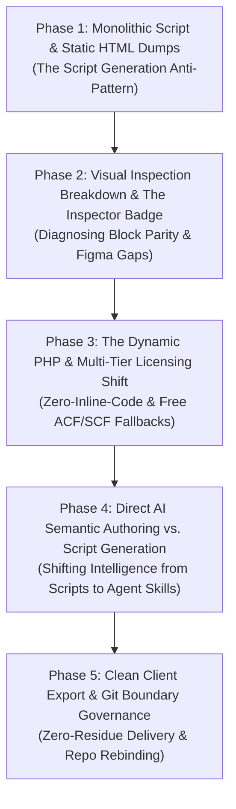

# 🏛️ Universal CMS Workflow: Retrospective, Historical Decisions & Architectural Evolution

## Executive Summary

This document captures the complete evolution of the **Universal CMS & Headless Agency Workflow**, detailing the architectural journey, the challenges encountered at each milestone, the pivotal historical decisions made to resolve them, and the final engineering conclusions.

---

## 1. Timeline & Milestone Evolution

---

## 2. Milestone Deep-Dives: Challenges, Pivots & Decisions

### Phase 1: Monolithic Script & Static HTML Generation (The Initial Trap)
- **The Challenge**:
  - The workflow initially relied on a Node.js generation script (`engine/scripts/generate-target-code.mjs`) containing looped static strings and basic string replacements.
  - When new or non-standard components were encountered, the script failed silently, copying static preview HTML directly into PHP files without dynamic CMS bindings.
  - Files had hardcoded text, no separation between data and presentation, and skipped already existing files due to `if (!fs.existsSync(targetFile))` guards.
- **Historical Decision & Shift**:
  - **Decoupled Architecture**: Eliminated the script-as-a-code-author paradigm. The script was demoted to a lightweight **Environment Scaffolder** (`style.css`, `functions.php`, `inc/` helpers), while the **Specialized AI Agent** (`wordpress-php-architect`) was mandated to directly read vision annotations and author clean, modular code.

---

### Phase 2: Visual Verification & Component Inspector Studio
- **The Challenge**:
  - Developers and stakeholders had no easy way to identify which component corresponded to which file, Figma node ID, or visual coordinate during preview reviews.
  - Correcting broken or inaccurate blocks required tedious manual inspection across multiple directories.
- **Historical Decision & Shift**:
  - **Component Vision Inspector**: Built an interactive inspector badge directly into the preview assembler (`scripts/assemble-preview.mjs`).
  - **One-Click Vision Agent Prompt**: Each rendered block in `dist-preview/` was equipped with a top-right floating badge. Clicking the badge copied a perfectly structured vision-prompt containing the component name, file path, reference screenshot, exact coordinates (`x, y, w, h`), and expected fields directly to the clipboard.

---

### Phase 3: Dynamic PHP Templates, Zero-Inline-Code & Licensing Realities
- **The Challenge**:
  - The generated templates had inline `<script>` tags, inline `style=""` attributes, and assumed the user possessed an active ACF Pro license with database rows already populated.
  - If loaded on a fresh WordPress install or with free ACF/Secure Custom Fields (SCF), the site broke or rendered blank sections.
- **Historical Decision & Shift**:
  - **Zero Inline Code Standard**: Mandated 100% Tailwind utility classes (e.g., removing `style="width: 100%"` in favor of `w-full`) and enqueuing via `wp_enqueue_scripts()`.
  - **Data Controller vs. Markup Separation**: Every PHP template was structured with a strict PHP Data Controller header followed by pure semantic HTML markup.
  - **Multi-Tier Fallback API (`app_get_repeater_rows()`)**: Built a universal fallback mechanism:
    1. Check `have_rows()` (if ACF Pro is active).
    2. Check post meta / JSON (for Free ACF, Secure Custom Fields, or OpenFields).
    3. Gracefully fall back to pre-populated `$default_*` visual arrays matching the mockup.
  - **Zero-Database-Entry Guarantee**: The theme renders with 100% visual fidelity immediately upon activation on a fresh WordPress install with zero posts or database entries.

---

### Phase 4: Companion ACF JSON Schemas & Complete Block Inventory
- **The Challenge**:
  - Out of 31 total blocks (25 unique, 6 shared), only 7 had partial dynamic fields. 24 remained raw or partially static.
- **Historical Decision & Shift**:
  - **Full AI Synthesis**: Synthesized all 25 unique blocks and 6 shared blocks with full PHPDoc documentation and dynamic bindings.
  - **14 Companion ACF JSON Schemas**: Placed in `dist-client/acf-json/` (`group_about_manifesto.json`, `group_plp_filters.json`, `group_pdp_buy_box.json`, etc.) allowing WordPress to auto-sync field definitions on theme activation.
  - **Automated Structural Linter**: Built a custom node validator (`validate-php.mjs`) to verify tag balance, brace matching, zero inline scripts, and zero inline styles across all 38 PHP files.

---

### Phase 5: Client Delivery, Git Governance & Repository Separation
- **The Challenge**:
  - The local repo was initially bound to an old remote (`FigmaDumpWorkflow.git`).
  - The repository contained massive historical git blobs (~700MB of direct Figma AST image dumps and screenshots), causing GitHub HTTP 408 timeout errors during `git push`.
- **Historical Decision & Shift**:
  - **Remote Rebinding**: Unbound `FigmaDumpWorkflow.git` and cleanly bound to [`https://github.com/sudipto21in2024/UniversalCMSWorkflow.git`](https://github.com/sudipto21in2024/UniversalCMSWorkflow.git).
  - **Git Ignore Governance**: Added heavy dumps and deliverable folders to `.gitignore`:
    - `Docs/DirectDataDump/`
    - `dist-preview/`
    - `dist-test/`
    - `dist-client/`
    - `inputs/vision/*.png`
  - **Clean Orphan Reconstitution**: Rebuilt `main` as a clean, lightweight commit and pushed it successfully to GitHub.

---

## 3. Key Architectural Principles Established

| Principle | Implementation in UniversalCMSWorkflow |
| :--- | :--- |
| **1. Single-Target Lock** | Exactly one target platform is configured per client in `.workflow-state.json`. No messy multi-CMS hybrid spaghetti. |
| **2. Visual Approval Gate** | Stakeholders review static HTML5 + Tailwind previews (`npm run preview:html`) before native backend code is finalized. |
| **3. Agent-Native Authoring** | Specialized subagent skills (`wordpress-php-architect`, `shopify-liquid-architect`) apply semantic intelligence to generate templates. |
| **4. Multi-Tier Licensing Resilience** | Templates work out-of-the-box on Free ACF, Secure Custom Fields (SCF), ACF Pro, or Native Post Meta. |
| **5. Zero-Database-Entry Fallback** | Pre-populated `$default_*` arrays guarantee instant visual parity on fresh installations. |
| **6. Zero Inline Code** | Clean separation of PHP data resolution from semantic presentation markup; zero inline styles or scripts. |

---

## 4. Final Conclusion & Reality of Automated Code Generation

### The Core Insight
Full automation in web and CMS engineering cannot be a blind, unassisted "one-click magic button." Real-world client projects require **semantic data modeling**, **licensing adaptability**, and **design token reconciliation** that purely static scripts cannot deliver.

### The AI-Augmented Sweet Spot
1. **AI Handles the 85–90% Heavy Lifting**:
   - Design token extraction and Tailwind translation.
   - Component taxonomy classification and bounding-box modeling.
   - Repetitive PHP/Liquid/React component scaffolding and PHPDoc documentation.
   - ACF JSON schema group creation and fallback array population.
2. **Human Developer Acts as the Strategic Architect / Reviewer**:
   - Grounding ambiguous or deeply nested Figma layers via the Visual Annotator.
   - Reviewing the HTML Visual Approval Gate in the browser.
   - Verifying target platform configuration and client licensing requirements.

This balanced, gate-driven architecture delivers high-velocity, production-grade output while eliminating the bugs, spaghetti code, and brittle failures of fully unguided automation.
