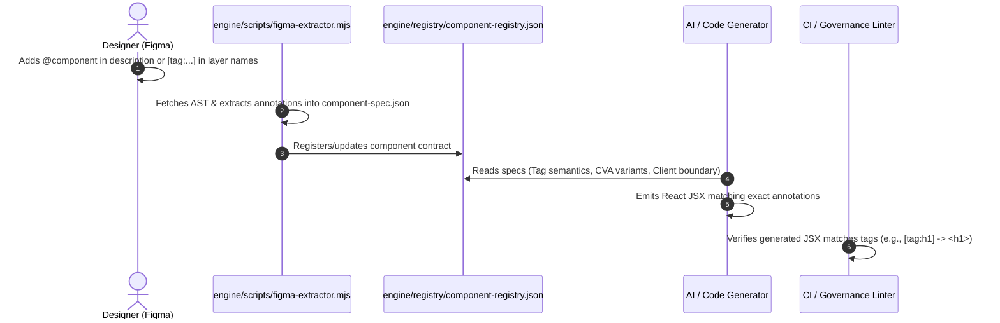

# Architecture & Specification: Annotation-Driven Figma-to-Code Framework

> **Status:** Approved Blueprint for Future Implementation  
> **Target System:** Antigravity / Next.js 15 Figma-to-Code Toolchain  
> **Key Goal:** Eliminate AI guessing by making Figma layer metadata the single source of truth for component structure, HTML semantics, accessibility, and client interactivity.

---

## 1. Executive Summary & Problem Statement

### The Problem
Traditional Figma-to-Code translation suffers from:
1. **Semantic Ambiguity:** An LLM or heuristic AST compiler often confuses an interactive `<button>` with a generic `<div>`, an `<h1>` with a styled `<p>`, or an `<article>` with a `section`.
2. **Missing Runtime Contracts:** Dynamic behaviors (e.g. `line-clamp`, responsive grid column collapses, `"use client"` hydration boundaries) are not naturally stored in raw Figma vector nodes.
3. **Prop Inconsistencies:** Component variant props (`size`, `variant`, `isLoading`, `badge`) frequently drift between design iterations and code generation.

### The Solution: Annotation-Driven Protocol
By utilizing native Figma metadata fields (**Component Descriptions**, **Component Property Definitions**, and **Layer Name Protocol Tags**), we create an explicit, zero-friction contract between designers and the code-generation engine without requiring paid plugins.

```mermaid
flowchart TD
    subgraph FigmaCanvas [Figma Design Canvas]
        A["Component Description Block (@component: Button, @as: button)"]
        B["Component Properties (variant=primary, size=md, isLoading=false)"]
        C["Layer Protocol Tags ([tag:h2][behavior:line-clamp-2] title)"]
    end

    subgraph ExtractionEngine [Figma Extraction Engine (engine/scripts/)]
        D[Figma REST API AST Fetcher]
        E[AST Annotation & Metadata Parser]
        F[Component Registry Normalizer]
    end

    subgraph CodeGeneration [Next.js Code Generation]
        G[TypeScript Interfaces & CVA Variant Props]
        H[Semantic React Components]
        I[Automated Governance & Lint Validation]
    end

    A --> D
    B --> D
    C --> D
    D --> E --> F
    F --> G --> H
    H --> I
```

---

## 2. The 4 Native Figma Metadata Channels

| Channel | Location in Figma | JSON AST Path | Use Cases & Responsibilities |
| :--- | :--- | :--- | :--- |
| **1. Component Description** | Right Sidebar $\rightarrow$ *Description* field | `component.description` | Full component contracts, export paths, prop schemas, accessibility specs (`@component`, `@as`, `@props`). |
| **2. Component Properties** | Right Sidebar $\rightarrow$ *Properties (`+`)* | `componentPropertyDefinitions` | Mapping directly to React `cva()` variants, boolean flags (`hasIcon`, `isLoading`), and text slots. |
| **3. Micro-Annotation Tags** | Layer Name (Canvas Tree) | `node.name` | Granular per-node overrides for HTML tags, responsive layouts, dynamic text truncations, and client directives. |
| **4. Dev Mode Annotations** | Shift+A / Right-click $\rightarrow$ *Add Annotation* | `node.devStatus`, `annotations` | Design notes, API integration boundaries, and QA requirements. |

---

## 3. Schema & Syntax Specifications

### A. Component Description Contract (YAML Schema)
When declaring a master component in Figma, write a structured YAML block inside the **Description** input:

```yaml
@component: ProductCard
@as: article
@export: src/components/shared/product-card.tsx
@client: false
@props:
  name: string
  categoryDesc: string
  price: string
  originalPrice: string?
  badge:
    text: string
    type: [discount, new]
  imageSrc: string
@slots:
  hoverActions: slot
@a11y:
  role: article
  label: Product Item Card
```

### B. Structural Layer Prefix Protocol (Micro-Annotations)
For ad-hoc frames, text layers, and non-component containers, use square-bracket tags directly in the layer name:

$$\text{Syntax: } \mathbf{[tag:\langle elem\rangle][layout:\langle spec\rangle][behavior:\langle rule\rangle][client:\langle bool\rangle]\ \text{LayerName}}$$

```text
[tag:h1][behavior:truncate] HeroTitle
[tag:section][layout:grid-cols-4] ProductGridContainer
[tag:button][client:true][role:button] AddToCartBtn
[tag:nav][role:navigation] HeaderNavBar
[tag:span][color:text-gold] PriceHighlight
[icon:slot][color:inherit] ChevronRightIcon
```

---

## 4. Extraction Engine Architecture (`engine/scripts/figma-extractor.mjs`)

The extraction engine parses both layer tags and YAML description blocks during AST traversal:

```javascript
import yaml from "js-yaml";

/**
 * Extracts and normalizes semantic annotations from a Figma node.
 * @param {Object} node - Figma AST node
 * @returns {Object} Normalized metadata object
 */
export function parseNodeAnnotations(node) {
  const metadata = {
    tag: null,
    role: null,
    behavior: null,
    isClient: false,
    layout: null,
    componentContract: null,
    customProps: {},
  };

  // 1. Parse Layer Name Protocol Tags (e.g. [tag:h2][behavior:line-clamp-2])
  if (node.name) {
    const tagMatches = node.name.matchAll(/\[([a-zA-Z0-9_-]+):([^\]]+)\]/g);
    for (const match of tagMatches) {
      const [, key, value] = match;
      if (key === "tag") metadata.tag = value.toLowerCase();
      else if (key === "role") metadata.role = value.toLowerCase();
      else if (key === "behavior") metadata.behavior = value;
      else if (key === "client") metadata.isClient = value === "true";
      else if (key === "layout") metadata.layout = value;
      metadata.customProps[key] = value;
    }
  }

  // 2. Parse Component Description YAML Block
  if (node.description && node.description.includes("@component")) {
    try {
      // Normalize @field syntax to standard YAML
      const yamlContent = node.description
        .replace(/@([a-zA-Z0-9_-]+):/g, "$1:");
      metadata.componentContract = yaml.load(yamlContent);
    } catch (err) {
      console.warn(`[Extractor] Failed to parse YAML description for node ${node.id}:`, err.message);
    }
  }

  return metadata;
}
```

---

## 5. End-to-End Workflow & Governance Matrix



### Deterministic Governance Rules
1. **Tag Invariance:** If a Figma layer has `[tag:h1]`, the compiler **must** render `<h1>`. The CI linter will reject `<div>` or `<h2>`.
2. **Hydration Boundary (`"use client"`):** Layers marked with `[client:true]` automatically generate client-side components with event bindings (`onClick`, `useState`). All other modules remain React Server Components (RSC) for maximum performance.
3. **No Duplicate Components:** When a Figma node matches a component in `component-registry.json`, the compiler **must** import the existing shared component instead of generating duplicate code.

---

## 6. Implementation Milestones

- [ ] **Phase 1: Annotation Parser Implementation**
  - Integrate `parseNodeAnnotations()` into `engine/scripts/`.
  - Output normalized `docs/specs/screen-spec.json` with extracted metadata.
- [ ] **Phase 2: Component Registry Sync**
  - Automate updating `engine/registry/component-registry.json` directly from Figma `@component` descriptions.
- [ ] **Phase 3: Prompt & Generator Calibration**
  - Update `.antigravity/prompts/make-component.md` and `.antigravity/prompts/make-page.md` to strictly follow parsed metadata.
- [ ] **Phase 4: Semantic CI Linter**
  - Create `engine/scripts/figma-linter.mjs` to validate generated TypeScript/JSX against layer annotations.
