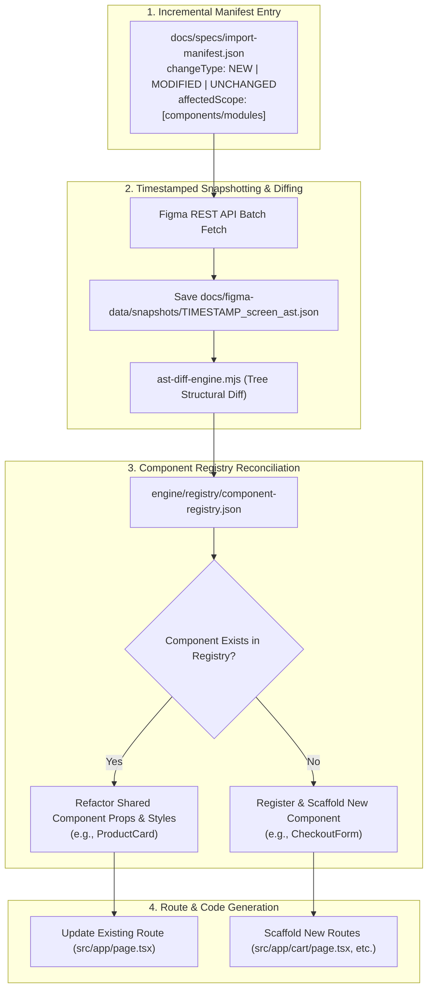
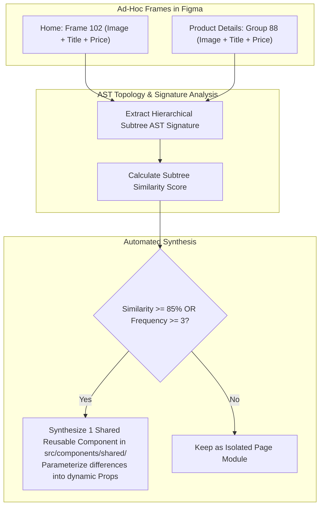

# Architectural Decisions & Multi-Page Workflow Specification (Version 3)

> **Document Version:** 3.0.0  
> **Last Updated:** September 2, 2026  
> **Status:** Ratified & Implemented Architecture  

This document captures the critical design and architecture decisions made for the Figma-to-Code automation system, addressing real-world scenarios including **incremental page imports**, **differential design updates**, **non-componentized Figma files**, and **production export hygiene**.

---

## 1. Incremental Page Imports & Differential Update Handling

### The Problem
When 3 pages are initially generated, and later 2 new pages arrive alongside design changes to an existing page:
- How does the system avoid re-generating existing pages from scratch?
- How does the system isolate modified components without breaking dependent pages?

### The Architecture & Solution



### Delta Schema in `docs/specs/import-manifest.json`
Each screen entry includes explicit delta flags:
```json
{
  "screens": [
    {
      "nodeId": "117:336",
      "name": "Home",
      "targetRoute": "/",
      "targetPageFile": "src/app/page.tsx",
      "modulesDir": "src/components/modules/home",
      "changeType": "MODIFIED",
      "changeDescription": "Updated Hero Banner headline layout and added promo badge",
      "affectedScope": ["hero-banner", "ProductCard"]
    },
    {
      "nodeId": "119:120",
      "name": "Cart",
      "targetRoute": "/cart",
      "targetPageFile": "src/app/cart/page.tsx",
      "modulesDir": "src/components/modules/cart",
      "changeType": "NEW",
      "changeDescription": "Initial generation of Cart drawer & item list",
      "affectedScope": ["cart-drawer", "cart-item-row", "order-summary"]
    },
    {
      "nodeId": "117:538",
      "name": "Shop Catalog",
      "targetRoute": "/shop",
      "targetPageFile": "src/app/shop/page.tsx",
      "modulesDir": "src/components/modules/shop",
      "changeType": "UNCHANGED"
    }
  ]
}
```

---

## 2. Tracking Identical Components Across Different Pages

### The Problem
When the same component (e.g. `ProductCard`) is used on both the **Home** page and the **Product Details** page, Figma assigns completely different instance Node IDs (e.g., `117:422` vs `117:910`).

### The Solution: 3-Layer Component Resolution
1. **Master Component ID (`componentId`)**:
   Figma instances contain a `componentId` pointing back to the Master Component node (e.g., `112:300`).
2. **Normalized Name Matching**:
   The engine normalizes layer names (`Product Card`, `Product Item`, `Card/Product`) against alias tables in `engine/registry/component-registry.json`.
3. **Multi-Node ID Registry Tracking**:
   The registry stores all known instance node IDs in a `figmaNodeIds: string[]` array.

---

## 3. Handling Non-Componentized Figma Designs (Ad-Hoc Frames)

### The Problem
Most pure UI/UX designers are not programmers and often do not create Master Components. They frequently:
- Copy-paste ad-hoc frames (`Frame 458`, `Group 12`, `Rectangle 33`).
- Detach components to make minor one-off tweaks.
- Introduce slight spacing inconsistencies (e.g. 15px vs 16px).

### The Solution: AST Fingerprinting & Structural Heuristics



1. **AST Subtree Topology Fingerprinting**:
   The engine computes a structural hash based on child element order and types:
   $$\text{Container (FRAME)} \longrightarrow [\text{Image (RECTANGLE)}, \text{Title (TEXT)}, \text{Description (TEXT)}, \text{Price (TEXT)}]$$
2. **Structural Frequency Threshold**:
   Any subtree shape appearing $\ge 3$ times across any page is automatically synthesized into a single reusable component in `src/components/shared/`.
3. **Content Payload Inference**:
   The engine detects currency symbols (`$`, `Rs.`, `Rp`, `€`) $\rightarrow$ maps to `price` prop; image fills $\rightarrow$ maps to `imageSrc` prop.
4. **Token Snapping**:
   Minor pixel variances (14px/15px) snap to nearest Tailwind tokens (`tokens.css`) rather than emitting inline styles.

---

## 4. Bidirectional Traceability (`data-node-id`) & Clean Export

### The Problem
- Developers need to know which JSX element maps to which Figma node during visual validation and debugging.
- Production and client export bundles must not contain residual internal dev attributes.

### The Solution

#### A. Development-Time Traceability
Components are generated with `data-node-id` and `data-figma-name` attributes:
```tsx
// src/components/shared/product-card.tsx
export function ProductCard({ product }: { product: Product }) {
  return (
    <div
      data-node-id="117:422"
      data-figma-name="Product Card"
      className="group relative bg-surface-muted flex flex-col ..."
    >
      <div data-node-id="117:423" className="relative w-full h-72 ...">
        {/* ... */}
      </div>
    </div>
  );
}
```

#### B. Production Build Sanitization (`next.config.ts`)
Configured using Next.js compiler `reactRemoveProperties`:
```typescript
// next.config.ts
const nextConfig: NextConfig = {
  reactStrictMode: true,
  images: { unoptimized: true },
  compiler: {
    reactRemoveProperties: process.env.NODE_ENV === "production" ? {
      properties: ["^data-node-id$", "^data-figma-.*$"],
    } : false,
  },
};
```

#### C. Standalone Client Export Sanitization (`engine/scripts/export-client.mjs`)
When packaging into `dist-client/`, the export engine strips all `data-node-id` attributes and internal comments:
```javascript
content = content
  .replace(/\/\/\s*token-ignore[^\n]*/g, "")
  .replace(/\/\*\s*figma-node-[^*]*\*\//g, "")
  .replace(/\s*data-node-id="[^"]*"/g, "")
  .replace(/\s*data-figma-[a-zA-Z0-9_-]+="[^"]*"/g, "");
```

---

## 5. Summary Matrix of Architectural Guarantees

| Concern | Architectural Mechanism | Source of Truth |
| :--- | :--- | :--- |
| **Incremental Updates** | Timestamped Snapshots + AST Diff Engine | `docs/figma-data/snapshots/` & `engine/scripts/ast-diff-engine.mjs` |
| **Blast Radius Isolation** | Shared Component Registry vs Page Modules | `engine/registry/component-registry.json` |
| **Messy/Un-componentized Figma** | Structural AST Fingerprinting & Frequency Analysis | Subtree shape matching & semantic token snapping |
| **Multi-Page Tracking** | Master `componentId` + Node ID alias array | `figmaNodeIds` in registry |
| **Visual Validation QA** | Bidirectional `data-node-id` tags | JSX elements during dev mode |
| **Clean Distribution** | Compiler stripping & export sanitizer | `next.config.ts` & `engine/scripts/export-client.mjs` |
