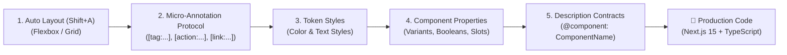

# Figma-for-AI Design System & Streamlining Guide

> **Target Audience:** UI/UX Designers & Design System Engineers  
> **Goal:** Structure Figma files to enable 100% deterministic, automated, production-ready Next.js/React code generation without manual translation friction.

---

## Executive Summary: The 5 Core Principles



---

## 1. Auto Layout Everywhere (The #1 Golden Rule)

AI code compilers translate Figma bounding boxes directly into **Flexbox (`display: flex`)** and **CSS Grid**. If Auto Layout is not used, the AI is forced to use absolute pixel positions (`top: 142px, left: 88px`), resulting in fragile, non-responsive code.

| Design Pattern | Avoid ❌ | Best Practice ✅ | Resulting Code |
| :--- | :--- | :--- | :--- |
| **Grouping Items** | `Ctrl+G` (Absolute Coordinates) | `Shift+A` (Auto Layout) | `flex flex-col gap-4` |
| **Buttons & Badges** | Rectangle shape with text on top | Frame with Fill + Padding | Responsive `<button>` that scales with content |
| **Card Rows & Grids** | Manually aligned cards | Auto Layout with **Fill container** / **Hug** | `grid grid-cols-1 md:grid-cols-4` |
| **Alignment** | Manual dragging | Set Alignment to Top-Left, Center, etc. | `items-center justify-between` |

---

## 2. Micro-Annotation Layer Naming Protocol

Designers do not need programming knowledge. When a specific HTML element, interactivity boundary, event, or layout behavior is needed, prepend standard bracketed tags directly to the layer name:

$$\text{Syntax: } \mathbf{[tag:\langle elem\rangle][action:\langle act\rangle][link:\langle route\rangle][behavior:\langle rule\rangle]\ \text{LayerName}}$$

### A. Semantic HTML Elements & Interactivity
| Layer Name in Figma | Generated Code / HTML Semantics | Purpose / Benefit |
| :--- | :--- | :--- |
| `[tag:h1] Hero Main Title` | `<h1 className="text-5xl font-bold">...</h1>` | Guarantees semantic heading hierarchy without AI guessing. |
| `[tag:h2] Section Heading` | `<h2 className="text-3xl font-semibold">...</h2>` | Standardized subtitle styling. |
| `[tag:button][client:true] AddToCartBtn` | `<button onClick={...} className="...">` | Automatically marks interactive components with `"use client"`. |
| `[behavior:line-clamp-2] ProductDesc` | `<p className="line-clamp-2 text-sm text-gray-500">` | Multi-line text truncation without manual CSS tweaking. |
| `[tag:nav] HeaderNavBar` | `<nav aria-label="Main Navigation">` | Semantic navigation container. |
| `[tag:article] ProductCard` | `<article className="...">` | Accessible semantic article wrapper. |

---

## 3. Modals, Popups & Drawers (`[modal:...]` / `[action:...]`)

Floating modals placed on the canvas often get rendered as static inline `<div>`s instead of interactive overlays. Use these annotations:

### The Trigger (Button that opens the popup):
```text
[tag:button][client:true][action:open-modal:cart-drawer] CartIconButton
[tag:button][client:true][action:open-modal:quick-view-modal] QuickViewBtn
```

### The Modal / Drawer Frame:
$$\text{Syntax: } \mathbf{[modal:dialog|drawer|toast|alert][id:\langle identifier\rangle][backdrop:blur|dark|transparent]}$$

```text
[modal:drawer][id:cart-drawer][position:right][backdrop:blur] CartDrawerOverlay
[modal:dialog][id:quick-view-modal][position:center][backdrop:dark] QuickViewDialog
```

### Generated React / Next.js Output:
```tsx
"use client";
import { useState } from "react";
import { Dialog, DialogContent, DialogOverlay } from "@/components/ui/dialog";

export function HeaderWithCart() {
  const [isCartOpen, setIsCartOpen] = useState(false);

  return (
    <>
      <button onClick={() => setIsCartOpen(true)} className="...">
        <CartIcon />
      </button>

      {/* Renders in Portal with Backdrop */}
      <Dialog open={isCartOpen} onOpenChange={setIsCartOpen}>
        <DialogOverlay className="backdrop-blur-sm bg-black/40" />
        <DialogContent className="fixed right-0 top-0 h-full w-[400px] ...">
          {/* Cart Drawer Content */}
        </DialogContent>
      </Dialog>
    </>
  );
}
```

---

## 4. Navigation Links & Dynamic Routing (`[link:...]`)

Generates typed **Next.js `<Link>`** components and secure external anchor tags:

| Figma Layer Name | Generated Next.js Component | Behavior |
| :--- | :--- | :--- |
| `[link:/] HomeLink` | `<Link href="/">Home</Link>` | Client-side route transition to `/` |
| `[link:/shop] ShopMenu` | `<Link href="/shop">Shop</Link>` | Client-side route transition to `/shop` |
| `[link:/product/[id]] ProductItem` | `<Link href={`/product/${product.id}`}>` | Dynamic route parameter interpolation |
| `[link:https://instagram.com][external:true] Social` | `<a href="https://..." target="_blank" rel="noopener noreferrer">` | Secure external tab opening |

---

## 5. Form Controls & Validation (`[form:...]` / `[input:...]`)

$$\text{Syntax: } \mathbf{[input:\langle type\rangle][name:\langle field\rangle][required:\langle bool\rangle]}$$

```text
[tag:form][action:submit-checkout] CheckoutForm
 ├── [input:text][name:firstName][required:true] FirstNameInput
 ├── [input:email][name:email][required:true] EmailInput
 ├── [input:tel][name:phone] PhoneInput
 ├── [input:select][name:country] CountryDropdown
 └── [input:number][name:quantity][min:1][max:99] QuantityStepper
```

### Generated TypeScript Interface & Form JSX:
```tsx
export interface CheckoutFormValues {
  firstName: string;
  email: string;
  phone?: string;
  country: string;
}

export function CheckoutForm({ onSubmit }: { onSubmit: (data: CheckoutFormValues) => void }) {
  return (
    <form onSubmit={handleSubmit(onSubmit)} className="space-y-4">
      <input type="text" {...register("firstName", { required: true })} placeholder="First Name" />
      <input type="email" {...register("email", { required: true })} placeholder="Email" />
      <input type="tel" {...register("phone")} placeholder="Phone Number" />
    </form>
  );
}
```

---

## 6. Dropdowns, Menus & Tabs (`[dropdown:...]` / `[tabs:...]`)

### A. Dropdown Menus:
```text
[dropdown:root] UserProfileMenu
 ├── [dropdown:trigger] UserAvatarButton
 └── [dropdown:content] MenuItemsOverlay
      ├── [dropdown:item][link:/profile] MyProfile
      ├── [dropdown:item][link:/orders] OrderHistory
      └── [dropdown:item][action:logout] LogoutButton
```

### B. Tab Panels (e.g. Product Page Tabs):
```text
[tabs:root] ProductTabsSection
 ├── [tabs:list] TabHeaderContainer
 │    ├── [tabs:trigger:desc][default:true] DescriptionTab
 │    ├── [tabs:trigger:info] AdditionalInfoTab
 │    └── [tabs:trigger:reviews] ReviewsTab (5)
 └── [tabs:content] TabPanels
      ├── [tabs:panel:desc] DescriptionContentFrame
      ├── [tabs:panel:info] AdditionalInfoContentFrame
      └── [tabs:panel:reviews] ReviewsContentFrame
```

---

## 7. Standardized Icon & Asset Naming

### Vector Icons (`.svg`):
- Prefix vector layers with `icon/` or `ic-` (e.g. `icon/shopping-bag`, `icon/search`, `icon/heart`, `icon/filter`).
- **Why**: The sync engine replaces hardcoded fill colors with `fill="currentColor"`, allowing icons to dynamically adapt to text colors via Tailwind CSS.

### Raster Images (`.png` / `.webp`):
- Name image fill containers with descriptive names (e.g. `image/hero-banner`, `image/product-syltherine`).
- Set explicit Aspect Ratios on the frame (e.g., `aspect-[4/3]`, `aspect-square`).

---

## 8. Native Component Properties & Variants

Instead of duplicating frames to show different states, use native **Figma Component Properties** (Right Sidebar $\rightarrow$ Properties `+`):

```
┌─────────────────────────────────────────────────────────────┐
│ Figma Component Property  │ Generated TypeScript Code       │
├───────────────────────────┼─────────────────────────────────┤
│ Variant: size (sm/md/lg)  │ cva variant: size: { sm, md }   │
│ Variant: variant (solid)  │ cva variant: variant: { solid } │
│ Boolean: hasBadge (true)  │ JSX conditional: {hasBadge && } │
│ Text: title ("Syltherine")│ Dynamic prop: title: string     │
└─────────────────────────────────────────────────────────────┘
```

---

## 9. Structured YAML in Component Descriptions

When declaring a master component in Figma, add a structured YAML contract into the **Description** input (Right Sidebar $\rightarrow$ Description):

```yaml
@component: ProductCard
@as: article
@props:
  name: string
  categoryDesc: string
  price: string
  originalPrice: string?
  badge:
    text: string
    type: [discount, new]
  imageSrc: string
@slots:
  hoverActions: slot
```

---

## 10. Design Tokens: Colors & Typography Styles

- **Colors**: Use Figma **Color Styles** (e.g., `Brand/Primary`, `Neutral/Surface-Muted`, `Text/Primary`) instead of unlinked hex codes (`#B88E2F`).
- **Typography**: Use Figma **Text Styles** (e.g., `Heading/H1`, `Body/Medium`, `Label/Small`).

---

## Complete Micro-Annotation Master Dictionary

```
┌────────────────────────────┬─────────────────────────────────┬──────────────────────────────────────────┐
│ Category                   │ Layer Annotation Syntax         │ Code / Runtime Result                    │
├────────────────────────────┼─────────────────────────────────┼──────────────────────────────────────────┤
│ 🔗 Navigation              │ [link:/route]                   │ <Link href="/route">                     │
│ 🔗 External Link           │ [link:url][external:true]       │ <a href="..." target="_blank">           │
│ 🪟 Modals & Dialogs        │ [modal:dialog][id:name]         │ <Dialog open={open}> in React Portal     │
│ 📦 Side Drawers            │ [modal:drawer][position:right]  │ <Sheet side="right">                     │
│ 🔘 Modal Triggers          │ [action:open-modal:name]        │ onClick={() => setOpen(true)}            │
│ ❌ Close Modal             │ [action:close-modal]            │ onClick={() => setOpen(false)}           │
│ ⚡ Event Actions           │ [action:add-to-cart]            │ Wire automated event callback            │
│ 📋 Form Controls           │ [input:email][required:true]    │ <input type="email" required />          │
│ 🔽 Dropdown Menus          │ [dropdown:root], [dropdown:item]│ Accessible Radix DropdownMenu            │
│ 📑 Tab Navigation          │ [tabs:root], [tabs:trigger:id]  │ Accessible Radix Tabs                    │
│ 🔄 Responsive Breakpoints  │ [hide:mobile] or [show:desktop] │ className="hidden md:block"              │
└────────────────────────────┴─────────────────────────────────┴──────────────────────────────────────────┘
```
