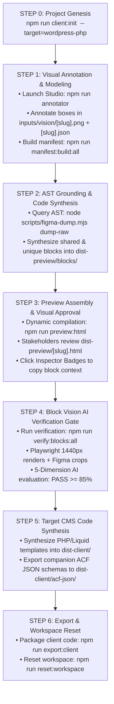

# 🏛️ Universal CMS Workflow & Agency Studio

A production-grade, multi-client engineering framework for converting visual UI designs (Figma AST dumps and annotated screenshots) into production-ready code across **any client-requested target architecture** (Shopify Native Liquid, WordPress Classic PHP, Headless Next.js, or Sitecore).

---

## 🌟 Core Architectural Philosophy

1. **Single-Target Project Lifecycle**: Exactly **one target platform** is locked per client engagement in `.workflow-state.json`. We never produce multi-CMS hybrid spaghetti.
2. **Figma JSON as Primary Ground Truth**: Exact colors, typography scales, vectors, dimensions, and layout alignments are rooted directly in offline Figma AST JSON dumps (`Docs/DirectDataDump/`).
3. **AST-First Grounding (Anti-Hallucination)**: Specialized AI subagents must query exact Figma AST node parameters (`scripts/figma-dump.mjs dump-raw <node_id>`) for `primaryAxisAlignItems`, `itemSpacing`, fills, and blur effects before generating code, strictly prohibiting generic heuristics or fake image placeholders.
4. **Decoupled Modular Block Architecture**: Pages are never generated as monolithic templates. Every screen is decomposed into **Shared (Reusable)** and **Unique (Page-Specific)** modular blocks following a strict **Deterministic Basename Contract**.
5. **Visual Approval Gate**: Stakeholders review responsive layouts, spacing, and typography in pure, standalone HTML5 + Tailwind CSS previews (`dist-preview/[slug].html`) with an interactive Component Vision Inspector *before* CMS backend code is finalized.
6. **Closed-Loop Block Vision AI Verification**: Headless Playwright captures 1440px renders of implemented blocks, crops corresponding design regions from source PNGs, and evaluates visual parity across 5 objective dimensions (Layout, Typography, Copy, Color/Mood, and UI Completeness).
7. **Multi-Tier CMS Licensing Resilience**: Generated WordPress themes implement universal accessor fallbacks (`app_get_field()`, `app_get_repeater_rows()`) that render 100% complete out-of-the-box on Free ACF, Secure Custom Fields (SCF), OpenFields, or ACF Pro.
8. **Zero-Residue Delivery & Reset**: Deliver clean, standalone client code (`npm run export:client`), then scrub all client artifacts back to a pristine starter baseline (`npm run reset:workspace`).

---

## 🔄 The End-to-End Workflow Pipeline



---

## 🛠️ Step-by-Step Operating Guide

### 1. Initialize Client Engagement (Step 0)
Locks the target CMS platform and sets up directory structure:

```bash
# Interactive setup:
npm run client:init

# Or direct flags:
npm run client:init skin-clinic --target=wordpress-php --name="Skin Clinic Luxury DTC"
```

Available Target Platforms:
- `wordpress-php`: Classic WordPress theme with PHP template parts + ACF Pro / Free SCF companion schemas.
- `shopify-liquid`: Native Shopify Liquid theme sections (`.liquid` + `` JSON blocks).
- `shopify-headless`: Headless Shopify with Next.js 15 App Router + GraphQL Storefront queries.
- `contentful-headless`: Headless Next.js 15 with Contentful migrations and GraphQL bindings.
- `sitecore-razor`: Sitecore .NET C# Helix models with Razor `.cshtml` views.
- `nextjs-standalone`: Standard Next.js 15 + Tailwind CSS application.

---

### 2. Visual Annotation Studio & Manifest Building (Step 1)
Launch the zero-dependency Visual Block Annotator Studio:

```bash
npm run annotator
# Running on http://localhost:4040
```

1. Drop page mockup screenshots into `inputs/vision/[slug].png`.
2. Draw bounding boxes around components.
3. Select platform-specific taxonomy presets (e.g. Flexible Content Layout, Repeater, Custom Post Type, Options).
4. For custom or unmapped sections, select `"Other / Custom Section (Deep-Search)"` and provide descriptive copy strings, card structures, and candidate fields in notes.
5. Slices and requirements are saved to `inputs/vision/[slug].json`.
6. Compile deterministic mapping manifests:
   ```bash
   npm run manifest:build:all
   ```
   This generates `inputs/vision/[slug].manifest.json` indexing all blocks with canonical basenames and artifact paths.

---

### 3. AST Grounding & Design Token Extraction (Step 2)
Before writing any code, query the offline Figma AST dump (`Docs/DirectDataDump/`):

```bash
# Deep semantic search from vision notes:
node scripts/figma-dump.mjs deep-search "Pure Solution Essence hero banner" --top=3

# Inspect raw AST geometry, fills, blurs, and typography:
node scripts/figma-dump.mjs dump-raw 27309:223

# Extract typography scale frequencies:
node scripts/figma-dump.mjs extract-typography 27309:223

# Extract color frequencies:
node scripts/figma-dump.mjs extract-colors 27309:223
```

#### Grounding Rules:
- **Never guess alignment**: Inspect `primaryAxisAlignItems` (`MAX` = bottom-pinned, `CENTER` = centered, `MIN` = top-pinned).
- **Never guess buttons**: Inspect `effects` for `BACKGROUND_BLUR` and exact opacity fills (e.g. `rgba(255, 255, 255, 0.16)`).
- **Never use random placeholders**: Match image hashes to `Docs/figma-data/asset-manifest.json` or local dump assets in `Docs/DirectDataDump/`.

---

### 4. Deterministic Basename Naming Convention Contract

All AI architect skills and human contributors must strictly follow the deterministic derivation rule:

| `targetSchema` in Vision JSON | Canonical Basename | Shared / Unique | Output Files |
| :--- | :--- | :--- | :--- |
| `global_header_options` | `header-nav` | Shared | `header-nav.html`, `header-nav.php`, `group_global_options.json` |
| `layout_hero_editorial` | `hero-editorial` | Unique | `hero-editorial.html`, `hero-editorial.php`, `group_hero_editorial.json` |
| `layout_product_query_grid` | `best-sellers-shelf` | Unique | `best-sellers-shelf.html`, `best-sellers-shelf.php`, `group_best_sellers.json` |
| `layout_category_tiles` | `category-spotlight` | Unique | `category-spotlight.html`, `category-spotlight.php`, `group_category_spotlight.json` |
| `layout_split_narrative` | `sheet-mask-feature` | Unique | `sheet-mask-feature.html`, `sheet-mask-feature.php`, `group_split_narrative.json` |
| `layout_testimonials_repeater` | `testimonials-slider` | Unique | `testimonials-slider.html`, `testimonials-slider.php`, `group_testimonials.json` |
| `layout_instagram_feed` | `instagram-gallery` | Shared | `instagram-gallery.html`, `instagram-gallery.php`, `group_instagram.json` |
| `layout_newsletter_capture` | `newsletter-banner` | Shared | `newsletter-banner.html`, `newsletter-banner.php`, `group_newsletter.json` |
| `global_footer_options` | `footer-global` | Shared | `footer-global.html`, `footer-global.php`, `group_footer.json` |

---

### 5. Universal Dynamic Assembler & Component Inspector (Step 3)
Compile pure, standalone HTML5 + Tailwind CSS previews:

```bash
npm run preview:html
```

- Compiles all screens dynamically from `dist-preview/blocks/shared/` and `dist-preview/blocks/unique/` into `dist-preview/[slug].html`.
- **Interactive Component Inspector**: Every section is wrapped in an interactive container with a top-right floating badge.
- Clicking any badge copies a structured AI vision prompt directly to your clipboard containing:
  - Component name & file path
  - Source mockup image path & bounding coordinates (`x, y, w, h`)
  - Figma Node ID
  - Expected copy strings and field requirements

---

### 6. Block-Level Vision AI Verification Gate (Step 4)
Run automated pixel-level block verification:

```bash
# Verify a single block:
node scripts/verify-blocks.mjs --slug=Homepage --block=block_2

# Verify an entire page:
node scripts/verify-blocks.mjs --slug=Homepage

# Verify all blocks across all screens:
npm run verify:blocks:all

# Clean up runtime temp files:
npm run verify:cleanup
```

#### How Block Verification Works:
1. **Layer 1 (Source of Truth)**: Full-page mockups (`inputs/vision/[slug].png`) are never modified permanently.
2. **Layer 2 (Runtime Temp Execution)**:
   - Playwright renders the HTML block at a 1440px viewport (`dist-preview/.tmp/renders/`).
   - Local `assets/...` are automatically inlined to base64 data URIs so Chromium's headless sandbox never produces broken images.
   - `pngjs` crops the corresponding design region from the source mockup (`dist-preview/.tmp/crops/`).
3. **Layer 3 (Evaluation & Reports)**:
   - Antigravity's native multimodal Gemini evaluates the design crop against the HTML render across 5 dimensions:
     - **Layout Structure** (columns, alignment, proportions, spacing)
     - **Typography Scale** (hierarchy, font size, weight, line wraps)
     - **Copy Accuracy** (verbatim text strings from spec)
     - **Color & Mood Match** (background tones, overlays, authentic photography)
     - **UI Completeness** (buttons, badges, icons, accordions)
   - Thresholds: **PASS ≥ 85%**, **WARN 70–84%**, **FAIL < 70%**.
   - Results are written back to `inputs/vision/[slug].manifest.json` and consolidated into `dist-preview/reports/[slug]-block-verification.json`.

---

### 7. Native CMS Code Generation & Multi-Tier Licensing (Step 5)
Synthesize production-grade CMS templates into `dist-client/`:

```bash
npm run client:generate
```

#### Multi-Tier Licensing Resilience:
The WordPress templates in `dist-client/template-parts/blocks/` use universal helper functions (`app_get_field()` and `app_get_repeater_rows()`):
```php
<?php
// 1. If ACF Pro is active -> Reads have_rows()
// 2. If Free ACF / Secure Custom Fields (SCF) / OpenFields is active -> Reads post meta / JSON
// 3. If fresh install (zero posts) -> Automatically falls back to built-in visual defaults
$testimonials = app_get_repeater_rows('testimonials_items', $default_testimonials);
?>
```
- **Zero Database Dependency**: The theme renders with 100% visual fidelity immediately upon activation on a fresh WordPress install.
- **Zero Inline Code**: Complete separation of PHP controller logic from semantic presentation markup. No inline `<script>` tags, inline `<style>` tags, or SQL queries.
- **14 Companion ACF JSON Schemas**: Auto-exported to `dist-client/acf-json/group_[basename].json`.

---

### 8. Design Token Governance (`--fix` Codemod)
Strictly enforce official design tokens from `src/styles/tokens.css` and eliminate arbitrary Tailwind bracket notation:

```bash
# Audit styling compliance:
npm run lint:tokens

# Automatically replace arbitrary brackets with official design tokens:
npm run lint:tokens:fix
```

---

### 9. Client Export & Zero-Residue Workspace Reset (Step 6)
Package clean client deliverables and scrub the workspace back to baseline:

```bash
# Export clean standalone client code (with asset tree-shaking):
npm run export:client

# Export as a compressed zip archive:
npm run export:client:zip

# Scrub all client routes, modules, images, and preview files back to pristine starter core:
npm run reset:workspace
```

---

## 🤖 Specialized AI Subagent Skills (`.agents/skills/`)

| Skill | Role & Output |
| :--- | :--- |
| **`shopify-vision-architect`** | Slices screenshots and models Shopify Metaobjects, Metafields, and Mermaid ERDs. |
| **`shopify-liquid-architect`** | Compiles approved HTML into native Shopify `.liquid` sections with customizer `` JSON settings into `dist-client/sections/`. |
| **`wordpress-php-architect`** | Compiles approved HTML into WordPress `.php` template parts with universal field accessors and companion ACF JSON schemas into `dist-client/`. |
| **`nextjs-tailwind-architect`** | Compiles approved HTML into React 19 / Next.js 15 App Router Server Components in `src/components/modules/`. |
| **`universal-cms-architect`** | Compiles Contentful migrations (`.js`), Sitecore serialization items, and multi-CMS GraphQL query contracts. |
| **`shopify-entity-architect`** | Generates automated JSON blueprints and provisions Shopify Admin Metaobjects via GraphQL. |

---

## 📁 Repository Directory Structure

```text
UniversalCMSWorkflow/
├── .agents/skills/                     # Specialized AI architect skills
├── engine/scripts/
│   ├── init-client.mjs                 # Project genesis & target architecture locker
│   ├── export-client.mjs               # Zero-residue client export packager
│   ├── reset-workspace.mjs             # Complete workspace scrubber utility
│   └── clean-assets.mjs                # Asset tree-shaking utility
├── tools/visual-annotator/             # Interactive bounding-box annotator studio
│   ├── presets/                        # Dynamic CMS taxonomy presets (Shopify, WP, Contentful, Next.js)
│   └── public/                         # Annotator canvas & Figma grounding inputs
├── inputs/vision/                      # Active client design screenshots, JSON specs & manifests
│   ├── [slug].png                      # Full-page high-resolution design mockup (never modified)
│   ├── [slug].json                     # Visual bounding boxes & entity requirements
│   └── [slug].manifest.json            # Deterministic block-to-artifact mapping index
├── dist-preview/                       # Zero-CMS standalone HTML5 approval previews
│   ├── blocks/shared/                  # Reusable HTML block components
│   ├── blocks/unique/                  # Page-specific HTML block components
│   ├── assets/                         # Local photographic and icon assets
│   ├── reports/                        # Permanent block verification AI reports
│   └── [slug].html                     # Dynamically assembled full-page previews
├── dist-client/                        # Deliverable target platform codebase (WordPress, Shopify, etc.)
│   ├── template-parts/blocks/          # Modular PHP template parts (shared/ & unique/)
│   ├── acf-json/                       # Companion ACF field group exports (group_*.json)
│   ├── inc/                            # Modular theme setup, field helpers, and template tags
│   └── assets/                         # Optimized client assets
├── scripts/
│   ├── assemble-preview.mjs            # Dynamic preview assembler with Inspector Badges
│   ├── build-manifest.mjs              # Manifest builder (derives canonical basenames)
│   ├── verify-blocks.mjs               # Block-level vision verification orchestrator
│   ├── cleanup-verify-tmp.mjs          # Runtime temp directory scrubber
│   ├── figma-dump.mjs                  # Offline Figma AST node resolver & semantic search
│   └── audit-tokens.mjs                # Design token auditor with --fix codemod
├── Docs/
│   ├── DirectDataDump/                 # Cached offline Figma AST JSON dumps
│   ├── HISTORICAL_DECISIONS_AND_CONCLUSIONS.md # Retrospective on architectural evolution & incident post-mortems
│   └── BLOCK_VISION_VERIFICATION_PLAN.md       # Block vision verification specification
└── package.json
```

---

## 🛠️ Complete CLI Command Reference

| Command | Purpose |
| :--- | :--- |
| `npm run client:init` | Initialize a new client engagement and lock target CMS platform |
| `npm run annotator` | Launch the Visual Block Annotator Studio on `http://localhost:4040` |
| `npm run manifest:build:all` | Build deterministic manifest indices (`[slug].manifest.json`) for all screens |
| `npm run preview:html` | Dynamically compile all HTML preview screens with Component Inspector Badges |
| `npm run verify:blocks -- --slug=Homepage` | Run block-level vision verification on a specific screen |
| `npm run verify:blocks:all` | Run block-level vision verification across all screens |
| `npm run verify:cleanup` | Scrub runtime temp crops and renders (`dist-preview/.tmp/`) |
| `npm run client:generate` | Synthesize target CMS code and companion schemas into `dist-client/` |
| `npm run lint:tokens` | Audit design token compliance in code |
| `npm run lint:tokens:fix` | Auto-repair arbitrary CSS values to official design tokens |
| `npm run export:client` | Package standalone client deliverable |
| `npm run export:client:zip` | Package standalone client deliverable as a `.zip` archive |
| `npm run reset:workspace` | Wipe client artifacts and reset workspace back to baseline |
| `npm run pipeline:full` | Run end-to-end audit: manifest build, preview assemble, block verification, and token linting |

---

## 📚 Core Documentation & Architecture Guides

- **[Architectural Recommendations & Control Framework](file:///c:/Sudipto/UniversalCMSWorkflow/Docs/RECOMMENDED_ARCHITECTURAL_IMPROVEMENTS.md)**: Five strategic enhancements to eliminate ambiguity, ensure bidirectional traceability from Figma to code, and enforce deterministic quality gates.
- **[Component Issues & Discrepancy Tracker](file:///c:/Sudipto/UniversalCMSWorkflow/Docs/COMPONENT_ISSUES_TRACKER.md)**: Permanent project audit ledger tracking component discrepancies, missing resources, and resolutions.
- **[Historical Decisions & Conclusions](file:///c:/Sudipto/UniversalCMSWorkflow/Docs/HISTORICAL_DECISIONS_AND_CONCLUSIONS.md)**: Chronological autopsy and evolution of our architecture, verification loop, and anti-hallucination protocols.
- **[AI Operating Guide (AGENTS.md)](file:///c:/Sudipto/UniversalCMSWorkflow/AGENTS.md)**: Mandatory rules, AST grounding directives, and subagent operational contract.
