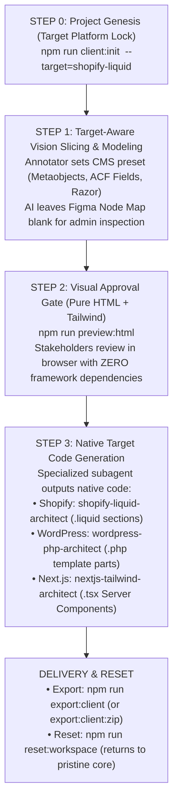

# 🏛️ Universal CMS Workflow & Agency Studio

A high-velocity, multi-client engineering framework for converting visual UI designs (Figma AST dumps and annotated screenshots) into production code across **any client-requested target architecture** (Shopify Native Liquid, WordPress Classic PHP, Headless Next.js, or Sitecore).

---

## 🌟 Core Architectural Philosophy

1. **Single-Target Project Lifecycle**: Exactly **one target platform** is locked per client engagement. We never mix or output multiple CMSs for a single project.
2. **Figma JSON as Primary Ground Truth**: Exact colors, typography scales, vectors, and spacing tokens are rooted directly in offline Figma AST JSON dumps (`Docs/DirectDataDump/`).
3. **Human-in-the-Loop Node Grounding**: The AI vision subagent slices layouts and models data schemas, leaving the `Figma Node ID` blank for the human admin to ground any complex or ambiguous layers.
4. **Visual Approval Gate**: Stakeholders review responsive layouts, spacing, and colors in pure, static HTML5 + Tailwind CSS (`dist-preview/[slug].html`) *before* backend templates or CMS bindings are generated.
5. **Zero-Residue Delivery & Reset**: Deliver clean, standalone client code (`npm run export:client`), then scrub all client artifacts back to a pristine starter baseline (`npm run reset:workspace`).

---

## 🔄 The 4-Step Single-Target Lifecycle



---

## 🚀 Quick Start & CLI Workflows

### 1. Initialize a New Client Project (Step 0)
Locks the target architecture into `.workflow-state.json` and auto-configures the Visual Annotator studio preset:

```bash
# Interactive Mode:
npm run client:init

# Flagged Mode:
npm run client:init skin-clinic --target=shopify-liquid --name="Skin Clinic Luxury DTC"
```

Available Target Platforms:
- `shopify-liquid`: Native Shopify Liquid theme sections (`.liquid` + ``)
- `shopify-headless`: Headless Shopify with React 19 / Next.js 15 App Router & GraphQL
- `wordpress-php`: Classic WordPress PHP template parts + ACF Pro field groups
- `contentful-headless`: Headless Next.js 15 with Contentful GraphQL & migrations
- `sitecore-razor`: Sitecore .NET C# Helix models with Razor `.cshtml` views
- `nextjs-standalone`: Standard Next.js 15 + Tailwind CSS app

---

### 2. Annotate Layouts & Ground Figma Nodes (Step 1)
Launch the Visual Block Annotator Studio on `http://localhost:4040`:

```bash
npm run annotator
# Or double-click: start-annotator.bat
```
- Drop mockup images into `inputs/vision/[slug].png`.
- Visual slices are saved to `inputs/vision/[slug].json`.
- **Figma Grounding**: Fill in the optional `Figma Node ID` in the block inspector card for any ambiguous or deeply nested elements.
- **Category "Other" & Deep-Search**:
  - For bespoke or unmapped sections, select Category: `"Other / Custom Section (Deep-Search)"`.
  - In `Requirements & Notes`, describe what the component looks like (e.g. headlines, prices, badges, and button copy).
  - During code generation, the AI agent automatically runs `node scripts/figma-dump.mjs deep-search "<description>"` to find the matching Figma AST node, dimensions, dominant colors, and font styles.

---

### 3. Generate HTML Visual Approval Preview (Step 2)
Compile pure, standalone HTML5 + Tailwind CSS previews into `dist-preview/[slug].html`:

```bash
npm run preview:html
# Or for a specific screen:
npm run preview:html -- --slug=Homepage
```
Open `dist-preview/Homepage.html` in any browser to verify responsive layouts, typography, and spacing with zero CMS dependencies.

---

### 4. Native Target Code Generation (Step 3 - Final Step)
Once the HTML preview is reviewed and approved by stakeholders, synthesize the native target code for the locked CMS platform (e.g. WordPress Classic PHP Theme + ACF Pro field groups, or Shopify Liquid sections):

```bash
# Generate native target code into dist-client/:
npm run client:generate
```
- **WordPress PHP**: Outputs `style.css`, `functions.php`, `index.php`, `header.php`, `footer.php`, `template-parts/blocks/shared/*.php`, `template-parts/blocks/unique/*.php`, and `acf-json/*.json`.
- **Shopify Liquid**: Outputs `.liquid` sections and customizer `` JSON blocks.
- **Headless Next.js**: Outputs App Router components with Tailwind CSS & Radix UI.

---

### 5. Enforce Official Design Tokens (`--fix` Codemod)
Strictly enforce official design tokens from `src/styles/tokens.css` and eliminate arbitrary Tailwind bracket notation:

```bash
# Audit styling compliance:
npm run lint:tokens

# Automatically replace arbitrary brackets with official tokens and log discrepancy comments:
npm run lint:tokens:fix
```

---

### 6. Client Export & Zero-Residue Workspace Reset
Package clean client code for delivery and wipe temporary client artifacts:

```bash
# Export clean standalone client code (with asset tree-shaking):
npm run export:client

# Export as a compressed zip archive:
npm run export:client:zip

# Scrub all client routes, modules, images, and state back to pristine core:
npm run reset:workspace
```

---

## 🤖 Specialized AI Subagents (`.agents/skills/`)

| Subagent Skill | Purpose & Output |
| :--- | :--- |
| **`shopify-vision-architect`** | Slices screenshots and models Shopify Metaobjects, Metafields, and Mermaid ERDs. Leaves `figmaNodeMap` blank for human entry. |
| **`shopify-liquid-architect`** | Compiles approved HTML into native Shopify `.liquid` sections with customizer `` JSON settings into `dist-client/sections/`. |
| **`wordpress-php-architect`** | Compiles approved HTML into WordPress `.php` template parts with ACF `get_field()` bindings into `dist-client/template-parts/`. |
| **`nextjs-tailwind-architect`** | Compiles approved HTML into React 19 / Next.js 15 App Router Server Components in `src/components/modules/`. |
| **`universal-cms-architect`** | Compiles Contentful migrations (`.js`), Sitecore serialization items, and multi-CMS GraphQL query contracts. |
| **`shopify-entity-architect`** | Generates automated JSON blueprints and provisions Shopify Admin Metaobjects. |

---

## 📁 Repository Directory Structure

```text
UniversalCMSWorkflow/
├── .agents/skills/                     # Specialized AI architect skills
├── engine/scripts/
│   ├── init-client.mjs                 # Project genesis & target architecture locker
│   ├── export-client.mjs               # Zero-residue client export packager
│   ├── reset-workspace.mjs             # Complete workspace scrubber utility
│   └── clean-assets.mjs                # Asset tree-shaking utility
├── tools/visual-annotator/             # Interactive bounding-box annotator studio
│   ├── presets/                        # Dynamic CMS taxonomy presets (Shopify, WP, Contentful, Next.js)
│   └── public/                         # Annotator canvas & Figma grounding inputs
├── inputs/vision/                      # Active client design screenshots & JSON slice annotations
├── scripts/
│   ├── audit-tokens.mjs                # Design token auditor with --fix codemod
│   ├── render-html-preview.mjs         # Visual Approval Gate HTML+Tailwind generator
│   └── figma-dump.mjs                  # Offline Figma AST node resolver
├── Docs/DirectDataDump/                # Cached offline Figma JSON dumps
├── references/cms-patterns/            # Production schemas (Shopify, Contentful, Sitecore)
├── src/                                # Active Next.js 15 runtime sandbox
│   ├── app/                            # Active client pages & routes
│   ├── components/                     # Atomic UI primitives & modules
│   └── styles/tokens.css               # Single source of truth for design tokens
└── package.json
```

---

## 🛠️ Verification & Build Commands

```bash
# TypeScript verification
npx tsc --noEmit

# Production Next.js build
npm run build

# Token & Styling Compliance Audit
npm run lint:tokens

# Run Visual Annotator Studio
npm run annotator
```
