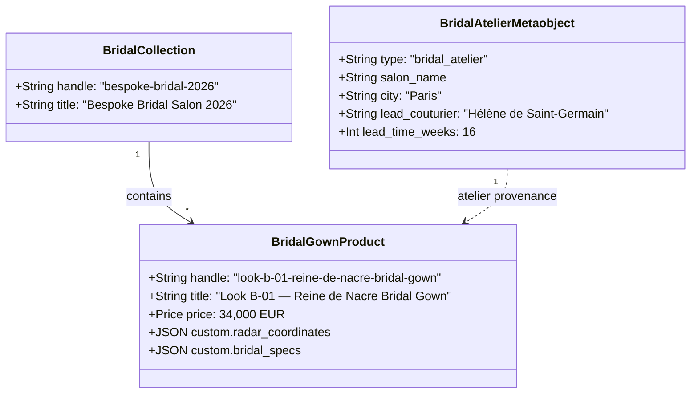

# Architectural Specification & Handoff Dossier: Bespoke Bridal Haute Couture Salon

## 1. Executive Summary & Business Objective
- **Business Need**: Support private bespoke bridal commissions at Maison Aura, showcasing custom veil lengths, fittings lead times, lead couturier attributions, and pearl armature corsetry coordinate hotspots.
- **Target Experience**: 
  - Dedicated `/collections/bespoke-bridal-2026` lookbook page.
  - Interactive radar inspector displaying seed pearl embroidery count, train lengths, and internal whalebone armature.
  - Private bridal salon appointment banner with contact notice and lead couturier details.
- **Architectural Strategy**:
  - Independent content entity **`bridal_atelier`** as a Shopify Metaobject.
  - Individual garment coordinates and specs in **`custom.radar_coordinates`** and **`custom.bridal_specs`** Product Metafields.
  - Curated **`bespoke-bridal-2026`** Collection.

---

## 2. Entity Relationship Diagram (ERD)



---

## 3. Entity Data Dictionary

### 3.1 Metaobject: `bridal_atelier`
| Field Key | Type | Storefront Access | Description |
| :--- | :--- | :--- | :--- |
| `salon_name` | `single_line_text_field` | PUBLIC_READ | Display name of the private salon |
| `city` | `single_line_text_field` | PUBLIC_READ | City location (e.g. Paris, New York) |
| `address` | `multi_line_text_field` | PUBLIC_READ | Full atelier salon address |
| `lead_couturier` | `single_line_text_field` | PUBLIC_READ | Name of Première / Master Couturier |
| `appointment_notice`| `multi_line_text_field` | PUBLIC_READ | Booking instructions & lead times |
| `lead_time_weeks` | `number_integer` | PUBLIC_READ | Minimum weeks required for creation |
| `media_asset` | `single_line_text_field` | PUBLIC_READ | URL to salon atelier imagery |

### 3.2 Product Metafields
| Key | Namespace | Type | Description |
| :--- | :--- | :--- | :--- |
| `radar_coordinates` | `custom` | `json` | Anatomical hotspot coordinates (pearl corset, cathedral train) |
| `bridal_specs` | `custom` | `json` | Veil pairing recommendations & recommended fitting sessions count |

---

## 4. Machine Blueprint Reference
- **Blueprint Path**: `docs/architecture/blueprints/bespoke_bridal_blueprint.json`
- **Execution Command**: 
  ```bash
  node scripts/shopify-provision.mjs --blueprint docs/architecture/blueprints/bespoke_bridal_blueprint.json
  ```
